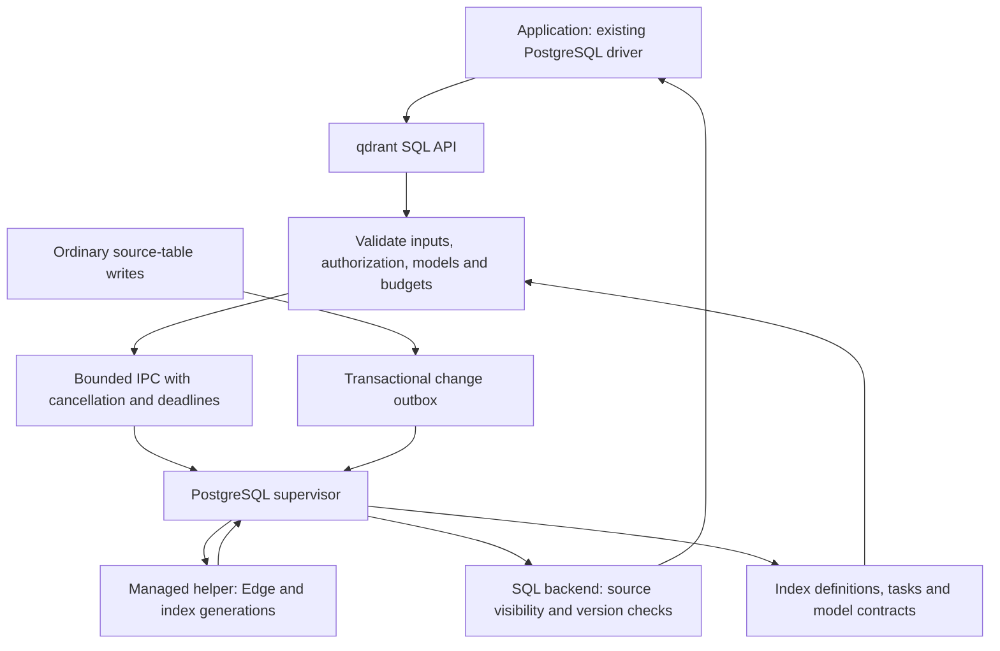

# pg_qdrant

**Embedded Qdrant for PostgreSQL.**

Full-text, vector, and multi-stage hybrid search over the data you already keep in PostgreSQL.

> **Status: P0 feasibility implementation.** The repository now includes an exact-version Rust workspace, Cargo.lock, public Edge API probes, and a restricted PostgreSQL worker/IPC prototype. The source-table indexing and search product described below is not implemented or release-supported. Private feasibility probes are not a production extension or a published benchmark.

## The goal

Keep your application data in ordinary PostgreSQL tables. Declare a search index, query it through SQL, and let the extension manage indexing, updates, retrieval, fusion, reranking, and maintenance.

The intended experience is:

1. Install the extension and register an existing table.
2. Run local full-text search without an embedding service.
3. Add application-generated dense, learned sparse, or token vectors when needed.
4. Choose a search plan instead of assembling a retrieval pipeline in application code.
5. Continue using `INSERT`, `UPDATE`, `DELETE`, and `COPY` for source data.
6. Inspect index progress, freshness, model coverage, and the plan that actually ran.

The default deployment is intended to work without a separately operated Qdrant network service. PostgreSQL remains the source of truth; the search index is a rebuildable projection.

Initial use cases are knowledge bases, document and chunk retrieval, and search over application content in self-hosted PostgreSQL.

## Planned search capabilities

The engine candidate is [Qdrant Edge](https://qdrant.tech/documentation/edge/edge-vs-qdrant-cluster/), accessed through its Rust library API. Edge and Qdrant Server have different lifecycle and deployment capabilities. Each feature must be verified against the pinned Edge release before it becomes a supported extension feature.

| Capability | Intended use |
| --- | --- |
| Local BM25 ranking | Keyword relevance scoring without external inference |
| Text matching and analysis | AND/OR, phrases, tokenization, normalization, and configured word prefixes |
| Exact and identifier-prefix matching | Keyword payload indexes for IDs, paths, URLs, or SKUs |
| Dense vectors | Semantic retrieval |
| Learned sparse vectors | Model-weighted lexical retrieval, separate from BM25 |
| Named vectors | Multiple representations of the same source row |
| Prefetch and fusion | Multi-stage retrieval with RRF, weights, or DBSF |
| Multivectors and MaxSim | Token-level late interaction and candidate reranking |
| Document grouping | Return documents with traceable matching chunks |
| Quantization | Evaluate scalar, product, binary, and supported Turbo modes |
| Matryoshka representations | Short-vector retrieval followed by compatible full-vector rescoring |
| Payload indexes and filtered search | Structured filters and authorized retrieval domains |
| Visual representations | Compatible global or patch-level image/document retrieval |
| Recommendation and discovery | Positive/negative examples, context, and feedback |
| MMR and formula scoring | Diversity and explicit business, time, or geographic signals |
| Facets, counts, sampling, and search matrices | Scoped search exploration and analysis |
| Instant search | Evaluate prefix, phrase, typo, and autocomplete behavior |

BM25 and learned sparse vectors have different encoding and scoring contracts. Binary quantization is also distinct from a native bit-vector input type; supported input types will be documented separately.

Semantic and visual representations are **bring your own vectors**. The application supplies model outputs; the extension validates dimensions, model identity, and content version. Full-text search uses local BM25 encoding. [Qdrant Edge provides an offline BM25 embedder](https://qdrant.tech/documentation/edge/edge-bm25/).

### Full-text search is more than BM25

BM25 is the default local ranking algorithm, not the entire text-search surface. The planned lexical layer combines ranking, matching, analysis, and presentation. Learned lexical representations such as SPLADE and miniCOIL use separately declared model contracts and supplied vectors; they are not additional offline inference engines bundled with the extension.

Qdrant's payload text index and BM25 sparse index are independent. Configuring a payload text index does not change BM25 tokenization. The extension must compile a versioned analyzer policy into both configurations and reject incompatible combinations. Phrase matching needs a phrase-enabled text index; whole-value keyword prefixes and token prefixes are different features. [Text-filter semantics](https://qdrant.tech/documentation/search/text-search/text-filtering/), [Edge matching API](https://docs.rs/qdrant-edge/0.8.0/qdrant_edge/enum.Match.html).

Typo tolerance, synonyms, query syntax, proximity, highlighting, and autocomplete ranking have explicit coverage requirements rather than implicit claims of native support. Text-search quality will be evaluated on Chinese and English content, identifiers, phrases, prefixes, and spelling errors. The [capability coverage contract](docs/capabilities.md) records upstream primitives, extension responsibilities, lexical gaps, and acceptance conditions.

## Dependencies and upstream upgrades

The implementation depends directly on the published `qdrant-edge` Rust crate for retrieval and local BM25, and on `pgrx` for PostgreSQL integration. Edge `0.8.0`, pgrx/cargo-pgrx `0.19.3`, and Rust `1.96.0` have passed a combined Linux PostgreSQL 17.11 build and scoped SQL feasibility tests at recorded earlier revisions. The latest CI built the normal extension but skipped all four SQL profiles after a disk experiment failed. This establishes a historical executable baseline; production capability and upgrade support remain separate gates in the version baseline.

Use released public APIs through an engine adapter. Track tokenizer configuration, model contracts, SQL API versions, and on-disk generations separately from dependency versions. An upstream update must pass capability, quality, authorization, lifecycle, and migration checks before it becomes a supported release.

See the [dependency and upgrade policy](docs/dependencies.md), the [version baseline](docs/dependency-baseline.json), and the [capability coverage contract](docs/capabilities.md). The repository includes a resolved Cargo.lock, a machine-readable dependency/features/license inventory, and P0 CI/update-bot configuration. Build and runtime evidence is recorded separately; configuration is not proof that CI or an update bot has run.

## Feasibility development

The supported product workflow remains the target described below. To run the
standalone engine experiments with Rust 1.96.0 and a C toolchain:

```sh
cargo check --locked -p pg-qdrant-edge-probe
cargo run --locked -p pg-qdrant-edge-probe
cargo test --locked -p pg-qdrant-edge-probe -- --test-threads=1
```

The probe uses the published Edge crate directly. Synthetic fixtures exercise
local BM25, dense/sparse/MaxSim, fusion, text constraints, grouping and persistence;
they do not establish production retrieval quality. See the [probe inventory](crates/edge-probe/README.md)
and [PostgreSQL prototype](crates/pg_qdrant/README.md) for exact scope and commands.

The [latest recorded CI](docs/evidence/p0-full-text-disk-ci.json), run
37729282903 at head `77f9ecc`, built and installed the normal extension, passed
15 engine tests, two helper child-bookkeeping tests, six Python runner tests,
and the narrow 32 MiB ENOSPC experiment. The separate 128 MiB full-text
experiment terminated with **SIGBUS at `recovery_reopen`**. All four PostgreSQL
SQL profiles were skipped, so this run provides no current SQL regression pass.
The signal and last stage are observed; the failing native allocation or I/O
operation has not been identified.

Earlier results remain evidence for their recorded source revisions:

| Record | Scoped result and remaining failure |
| --- | --- |
| [Initial PostgreSQL CI](docs/evidence/p0-postgresql-ci.json) | Direct-worker SQL diagnostics passed, but killing or aborting its engine owner terminated a companion SQL session; committed PostgreSQL data survived recovery |
| [Helper comparison CI](docs/evidence/p0-helper-ci.json), head `a22d3c7` | Direct SQL 10/12, helper SQL 10/15, and helper pipe 7/8 checks passed; helper native faults preserved the companion session and supervisor. The workflow failed at a 32 MiB disk experiment whose exit cause was not recorded |
| [Disk retry CI](docs/evidence/p0-disk-ci.json), head `cce2b41` | Filling reached real ENOSPC, but the temporary-file wrapper hid its raw errno; configuration-save/recovery and all SQL profiles were not reached |
| [Regression CI](docs/evidence/p0-regression-ci.json), head `1f9d8bb` | Narrow 32 MiB ENOSPC, direct SQL 10/12, normal-helper SQL 10 and pipe 7 checks passed. The private pipe observer failed with `ProcessLookupError`; private-helper SQL was not reached |

These helper results make the same-package helper the preferred topology
candidate. Process termination remains distinct from native query cancellation
and durable index recovery. The [stricter helper harness](docs/evidence/p0-helper-exit-local.json)
requires a live process identity before its controller-kill experiment; its
recorded local attempts failed that precondition without sending the kill.
Current SQL regression and forced PostgreSQL-supervisor SIGKILL remain open.

The current local locked engine suite passes **20 tests**, and the Python runner
suite passes **nine**. New engine-only checks cover lexical boundaries and
prefix truncation, full-text clean reopen, read-only loading with a test-supplied
manifest, and update-only preview/no-write branches. Fixed Edge 0.8.0's
`UpdateOnlyEdgeShard` Store, Delete and empty bootstrap paths are explicitly
unavailable: the probes observed their unimplemented panics. Ordinary
`EdgeShard` mutation is a separate tested path. None of these engine results
establish PostgreSQL authorization or source consistency.

A clean full-text reopen on an ordinary filesystem also records storage and
mapping measurements. Those observations motivate the separate clean tmpfs
control; they do not prove the cause of SIGBUS or a full-text ENOSPC recovery
pass. See the [build and fault instructions](docs/build.md) and [P0 report](docs/p0-report.md).
Full-text disk recovery, actual kernel OOM, production durability and release
gates remain open; the narrow disk success is not a complete storage contract.

[User journeys](docs/user-journeys.md), [phase acceptance](docs/acceptance.md),
the [P0 evidence report](docs/p0-report.md), and the [work ledger](docs/work-items.json) retain all 54 formal capabilities and
integration work. [Build instructions](docs/build.md) distinguish configured,
compiled, runtime-tested, and release-supported environments.

## Search plans

The proposed API separates search mode (`text`, `hybrid`, `semantic`), interaction (`search`, `instant`), and retrieval plan:

| Plan | Intended pipeline |
| --- | --- |
| `text` | Local BM25 ranking with configured text/phrase/identifier constraints |
| `balanced` | BM25 + dense + configured learned sparse, with explicit fusion |
| `precision` | Candidate retrieval followed by compatible MaxSim reranking |
| `fast` | Suitable quantization or short representations, with configured rescoring |
| `visual` | Compatible cross-modal global or patch representations |
| `explore` | Recommendation, discovery, feedback, and diversity |
| `instant` | A dedicated interactive lexical strategy |

Plans declare required representations, candidate limits, filtering rules, and fallback behavior. Missing required inputs must produce an error unless an explicitly allowed fallback is ready. Responses must distinguish the requested plan from the effective plan.

Candidate reranking is exact only within its candidate domain. Rescoring a reduced-precision stored representation does not recover an unstored float32 original.

## Proposed SQL experience

**API sketch, not an executable quickstart.** Function names, settings, and return types remain subject to feasibility testing. Installing extension binaries will be required before `CREATE EXTENSION`; preload and restart requirements are not yet established.

```sql
CREATE EXTENSION pg_qdrant;

CREATE TABLE document_chunks (
    id          bigint GENERATED ALWAYS AS IDENTITY PRIMARY KEY,
    document_id bigint NOT NULL,
    title       text,
    body        text NOT NULL
);

-- Returns a build task ID. Configuration shape is provisional.
SELECT qdrant.create_index(
    index_name => 'knowledge',
    source     => 'document_chunks'::regclass,
    key_field  => 'id',
    settings   => '{"text":{"fields":["title","body"]}}'::jsonb
);

-- Run after the registration transaction commits.
SELECT qdrant.index_status('knowledge');

-- Once the text representation is ready:
SELECT c.document_id, c.title, h.rank, h.score
FROM qdrant.search(
    index_name => 'knowledge',
    q          => 'transaction recovery',
    mode       => 'text',
    top_k      => 10
) AS h
JOIN document_chunks AS c ON c.id = h.key::bigint
ORDER BY h.rank;
```

Hybrid search uses representations configured on the same index. In the following prepared-query sketch, `$1` is query text and `$2` contains the configured query vectors and model identifiers:

```sql
SELECT *
FROM qdrant.search(
    index_name    => 'knowledge',
    q             => $1,
    mode          => 'hybrid',
    query_vectors => $2::jsonb,
    options       => '{
        "plan": "precision",
        "group_by": "document_id",
        "fallback": "error"
    }'::jsonb
);
```

Proposed management functions include `create_index`, `configure_index`, `index_status`, `rebuild_index`, `drop_index`, and task status/wait/cancel operations. Waiting for committed source changes will have a separate contract from waiting for management tasks.

`search` is intended for relational results and joins. `search_page` adds scoped facets and execution metadata; `explain_search` describes the actual stages, budgets, and representation readiness.

Results should expose source keys, rank, score, grouping, snippets, and match provenance. Scores are not probabilities. Candidate counts must not be presented as global totals, and point counts must not be presented as document counts.

## Proposed architecture

The recommended implementation is **Rust + pgrx + Qdrant Edge**, with SQL installation and upgrade scripts. A separate Zig or Go glue layer is not part of the initial design.

[pgrx](https://github.com/pgcentralfoundation/pgrx) provides the PostgreSQL extension boundary. Qdrant Edge supplies the retrieval engine through its native Rust API. PostgreSQL still loads a native shared library through its C-compatible interface; writing extension code in Rust does not remove that ABI boundary.

The eventual package needs the native library, extension control file, and SQL installation/upgrade scripts. Builds and compatibility tests must target each supported PostgreSQL major and platform. Application drivers connect through the PostgreSQL protocol; the extension itself uses server APIs, not a client connection through `libpq`.



The preferred process-layout candidate gives each database a PostgreSQL supervisor
and a managed engine helper in the same installation, supported by the scoped
native-failure experiments above. The direct-worker
experiment remains available for comparison. Each index generation must have
one shard owner; SQL sessions do not independently open the same shard directory.
The complete source-table architecture shown above is still a product design,
not the scope of the diagnostic prototype.

Engine threads receive owned data and must not use PostgreSQL pointers, memory contexts, or SPI. PostgreSQL-facing work remains on the appropriate process thread. This boundary follows [pgrx's documented threading constraints](https://github.com/pgcentralfoundation/pgrx#caveats--known-issues).

Queues, candidate counts, token matrices, response sizes, engine threads, memory, and execution time need explicit limits. An engine runtime, if required, must be initialized in its owning child process rather than inherited from postmaster initialization.

Worker crash behavior and threaded-engine integration are feasibility gates.
The direct-worker experiment demonstrated collateral session termination;
the helper contained the tested native failures and passed its bounded stop and
restart paths. The helper loads the Edge library directly and exposes no Qdrant
network-service API; the intended installation experience remains one managed
package. Production topology acceptance still requires the remaining fault,
resource and persistence evidence. The measured helper results do not establish
OOM, durable indexing, or backup/recovery support.

Applications are intended to keep using standard PostgreSQL drivers from Rust, Go, Python, JavaScript, or other languages. No language-specific Qdrant client is required for the SQL interface. A pgvector type adapter may be added later; pgvector is not a required engine dependency in the proposed design.

## Consistency and security contract

The initial design uses an **asynchronous derived index**, not a PostgreSQL index access method.

- Source changes and durable indexing events commit together in PostgreSQL.
- Workers process committed events and acknowledge them only after the promised engine persistence condition is met.
- Replays must be idempotent; deletion and primary-key reuse must not resurrect old data.
- Vectors must match the current content fingerprint and model contract. Late model outputs cannot overwrite newer content.
- Post-commit waiting identifies a fixed set of changes. It cannot wait for its own uncommitted transaction.
- Source visibility and version checks remove invalid candidates, but cannot restore relevant candidates absent from the derived index.
- Authorization applies to every retrieval stage, snippets, statistics, recommendations, caches, and diagnostics.
- RLS policies that cannot be safely supported must be rejected explicitly.

Same-transaction read-your-writes and exact ranking for arbitrary historical MVCC snapshots are outside the initial contract. Edge persistence does not create an atomic transaction with PostgreSQL WAL.

Rebuilds are intended to construct and catch up a new generation before switching queries. PostgreSQL source data, configuration, and retained vector inputs form the rebuild source. Backup/PITR, replication, and failover require separate validation before being listed as supported.

## Roadmap

P0 is in progress. P1–P5 remain pending; the work ledger records their complete scope.

| Milestone | Exit condition |
| --- | --- |
| **P0: Feasibility** | Reproducible Rust/pgrx/Edge build; real SQL-to-engine queries; concurrency, cancellation, memory, and crash experiments |
| **P1: Data lifecycle** | Registration, backfill, committed updates, deletion, versioned vectors, replay, and post-commit waiting pass correctness tests |
| **P2: Core search** | Text, balanced, and precision plans; grouping and result contracts; multilingual quality evaluation and authorization tests |
| **P3: Performance and operations** | Fast plans, filtering, bounded resources, optimization, generation switching, recovery, and upgrade validation |
| **P4: Advanced retrieval** | Visual/explore plans, feedback, MMR, formulas, facets/matrices, and instant search have tested contracts and examples |
| **P5: Distribution** | Clean-install packages, CI, installation/upgrade documentation, compatibility matrix, licenses, and reproducible examples |

The initial platform candidate is Linux x86_64 with PostgreSQL 17. The exact Rust, pgrx, and Edge combination and its current evidence are recorded in the version baseline. Other PostgreSQL majors, operating systems, and managed PostgreSQL services are not supported claims at this stage.

Future benchmark reports should separate retrieval quality from engine efficiency and report model inputs, hardware, candidate budgets, latency, memory, indexing, updates, and recovery. There are no performance claims yet.

## Scope and contributions

File parsing, document chunking, model training, a GPU inference platform, and a hosted distributed search service are outside the initial scope.

The default direction uses one retrieval engine. Tantivy or pg_search integration will be evaluated only if measured lexical-search gaps justify the extra indexing, fusion, lifecycle, and licensing work.

Use [GitHub Issues](https://github.com/JamesbbBriz/pg_qdrant/issues) to share concrete PostgreSQL workflows, multilingual queries, deployment constraints, or reproducible feasibility findings. API and architecture proposals are welcome; compatibility and performance assertions should include evidence.

## License and project identity

Independently developed project code is licensed under [Apache-2.0](LICENSE). Dependencies retain their own licenses. [NOTICE](NOTICE) and the [resolved dependency inventory](docs/dependency-graph.json) record attribution and package-declared licensing; complete third-party distribution notices remain a release gate.

pg_qdrant is an independent community project and is not an official Qdrant product.
