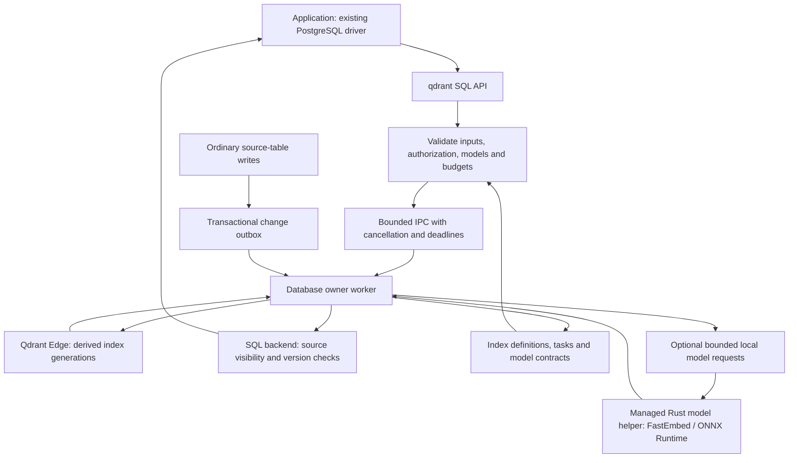

# Product and implementation design

Status: proposed design. The repository has no installable extension or implemented SQL API yet. Capability, runtime, platform, and recovery contracts require feasibility testing before release.

See the [project overview](../README.md) for the intended developer experience. This document describes the detailed capability scope, SQL sketches, architecture, consistency rules, and delivery milestones.

## Planned search capabilities

The engine candidate is [Qdrant Edge](https://qdrant.tech/documentation/edge/edge-vs-qdrant-cluster/), accessed through its Rust library API. Edge and Qdrant Server have different lifecycle and deployment capabilities. Each feature must be verified against the pinned Edge release before it becomes a supported extension feature.

| Capability | Intended use |
| --- | --- |
| Local BM25 ranking | Keyword relevance scoring without external inference |
| Text matching and analysis | AND/OR, phrases, tokenization, normalization, and configured word prefixes |
| Exact and identifier-prefix matching | Keyword payload indexes for IDs, paths, URLs, or SKUs |
| Dense vectors | Semantic retrieval |
| Learned sparse vectors | Model-weighted lexical retrieval, separate from BM25 |
| Named vectors | Multiple representations of the same source row |
| Prefetch and fusion | Multi-stage retrieval with RRF, weights, or DBSF |
| Multivectors and MaxSim | Token-level late interaction and candidate reranking |
| Document grouping | Return documents with traceable matching chunks |
| Quantization | Evaluate scalar, product, binary, and supported Turbo modes |
| Matryoshka representations | Short-vector retrieval followed by compatible full-vector rescoring |
| Payload indexes and filtered search | Structured filters and authorized retrieval domains |
| Visual representations | Compatible global or patch-level image/document retrieval |
| Recommendation and discovery | Positive/negative examples, context, and feedback |
| MMR and formula scoring | Diversity and explicit business, time, or geographic signals |
| Facets, counts, sampling, and search matrices | Scoped search exploration and analysis |
| Instant search | Evaluate prefix, phrase, typo, and autocomplete behavior |

BM25 and learned sparse vectors have different encoding and scoring contracts. Binary quantization is also distinct from a native bit-vector input type; supported input types will be documented separately.

Semantic and visual representations support **bring your own vectors**. The application supplies model outputs; the extension validates dimensions, model identity, and content version. Optional local encoders must satisfy the same contracts and are validated separately from ranking models. Full-text search uses local BM25 encoding. [Qdrant Edge provides an offline BM25 embedder](https://qdrant.tech/documentation/edge/edge-bm25/).

### Full-text search is more than BM25

BM25 is the default local ranking algorithm, not the entire text-search surface. The planned lexical layer combines ranking, matching, analysis, and presentation. Learned lexical representations such as SPLADE and miniCOIL use separately declared model contracts and supplied vectors. Naming a representation does not promise a bundled model or a supported local encoder.

Qdrant's payload text index and BM25 sparse index are independent. Configuring a payload text index does not change BM25 tokenization. The extension must compile a versioned analyzer policy into both configurations and reject incompatible combinations. Phrase matching needs a phrase-enabled text index; whole-value keyword prefixes and token prefixes are different features. [Text-filter semantics](https://qdrant.tech/documentation/search/text-search/text-filtering/), [Edge matching API](https://docs.rs/qdrant-edge/0.8.0/qdrant_edge/enum.Match.html).

Typo tolerance, synonyms, query syntax, proximity, highlighting, and autocomplete ranking have explicit coverage requirements rather than implicit claims of native support. Text-search quality will be evaluated on Chinese and English content, identifiers, phrases, prefixes, and spelling errors. The [capability coverage contract](capabilities.md) records upstream primitives, extension responsibilities, lexical gaps, and acceptance conditions.

## Dependencies and upstream upgrades

The design depends directly on the published `qdrant-edge` Rust crate for retrieval and local BM25, and on `pgrx` for PostgreSQL integration. The initial exact-version candidates are Edge `0.8.0` and pgrx/cargo-pgrx `0.19.3`; the combined build has not been validated.

Optional model serving uses Rust adapters for [FastEmbed](https://github.com/Anush008/fastembed-rs) and [ONNX Runtime](https://onnxruntime.ai/). These are not required for local BM25 or BYOV retrieval. Their exact versions, native libraries, execution providers, and combined dependency graph must be pinned and validated before a model-enabled package is supported. Model weights and tokenizers have their own licenses and version contracts.

Use released public APIs through an engine adapter. Track tokenizer configuration, model contracts, SQL API versions, and on-disk generations separately from dependency versions. An upstream update must pass capability, quality, authorization, lifecycle, and migration checks before it becomes a supported release.

See the [dependency and upgrade policy](dependencies.md), the [version baseline](dependency-baseline.json), and the [capability coverage contract](capabilities.md). These describe planned dependencies and release gates; there is no compiled dependency graph, Cargo.lock, active update bot, or upgrade CI yet.

## Search plans

The proposed API separates search mode (`text`, `hybrid`, `semantic`), interaction (`search`, `instant`), and retrieval plan:

| Plan | Intended pipeline |
| --- | --- |
| `text` | Local BM25 ranking with configured text/phrase/identifier constraints |
| `balanced` | BM25 + dense + configured learned sparse, with explicit fusion |
| `precision` | Candidate retrieval followed by compatible MaxSim reranking |
| `fast` | Suitable quantization or short representations, with configured rescoring |
| `visual` | Compatible cross-modal global or patch representations |
| `explore` | Recommendation, discovery, feedback, and diversity |
| `instant` | A dedicated interactive lexical strategy |

Plans declare required representations, candidate limits, filtering rules, and fallback behavior. Missing required inputs must produce an error unless an explicitly allowed fallback is ready. Responses must distinguish the requested plan from the effective plan.

Candidate reranking is exact only within its candidate domain. Rescoring a reduced-precision stored representation does not recover an unstored float32 original.

## Optional local models and learning to rank

The extension is intended to own the local ranking workflow as well as retrieval. Qdrant Edge executes supported native retrieval, fusion, and MaxSim stages. Optional model adapters add learned scoring over bounded candidates; they do not replace those engine primitives.

| Path | Intended experience |
| --- | --- |
| Existing vectors | Keep producing vectors in the application and supplying their model and content versions |
| Local encoders | Generate compatible representations through an explicitly configured adapter; document and query encoding are separate contracts |
| Text-pair rerankers | Score query/document pairs with a validated local model, including supported FastEmbed adapters |
| Feature-based LTR | Bind authorized PostgreSQL fields and retrieval signals to a compatible ONNX ranking model |
| Supervised relevance improvement | Freeze judgments and feature data, train with a separate offline toolkit, evaluate, and import a versioned candidate |

ONNX is the first custom-model format under evaluation. A bundle must declare its inputs, outputs, preprocessing, tokenizer or feature schema, and resource requirements. Arbitrary ONNX files are not assumed compatible. GGUF and MNN are future candidates with separate feasibility gates.

A strategy can compose retrieval, fusion, native reranking, LTR, and an optional text-pair reranker. Each stage declares candidate, time, and memory budgets. The candidate budget is distinct from the final result count; quality claims must include both retrieval coverage and ranking evaluation.

The proposed workflow is **prepare → preview/compare → activate → rollback**. Preparation returns a task whose result contains a durable candidate reference. Evaluation and activation use that fixed reference. A model being ready to execute does not establish that it improves relevance, and training does not automatically activate it.

Model inference belongs in a packaged, managed Rust helper with bounded requests, deadlines, cancellation, and restart handling. Feature reads and authorization checks remain in the appropriate PostgreSQL context. Training is an offline operation, not work performed inside a SQL backend or search request.

Initial configuration uses ordinary SQL, structured options, model references, and explicit feature bindings. A textual tensor DSL is outside the initial release scope; expert users retain native query controls and per-stage tuning.

## Proposed SQL experience

**API sketch, not an executable quickstart.** Function names, settings, and return types remain subject to feasibility testing. Installing extension binaries will be required before `CREATE EXTENSION`; preload and restart requirements are not yet established.

```sql
CREATE EXTENSION pg_qdrant;

CREATE TABLE document_chunks (
    id          bigint GENERATED ALWAYS AS IDENTITY PRIMARY KEY,
    document_id bigint NOT NULL,
    title       text,
    body        text NOT NULL
);

-- Returns a build task ID. Configuration shape is provisional.
SELECT qdrant.create_index(
    index_name => 'knowledge',
    source     => 'document_chunks'::regclass,
    key_field  => 'id',
    settings   => '{"text":{"fields":["title","body"]}}'::jsonb
);

-- Run after the registration transaction commits.
SELECT qdrant.index_status('knowledge');

-- Once the text representation is ready:
SELECT c.document_id, c.title, h.rank, h.score
FROM qdrant.search(
    index_name => 'knowledge',
    q          => 'transaction recovery',
    mode       => 'text',
    top_k      => 10
) AS h
JOIN document_chunks AS c ON c.id = h.key::bigint
ORDER BY h.rank;
```

Hybrid search uses representations configured on the same index. In the following prepared-query sketch, `$1` is query text and `$2` contains the configured query vectors and model identifiers:

```sql
SELECT *
FROM qdrant.search(
    index_name    => 'knowledge',
    q             => $1,
    mode          => 'hybrid',
    query_vectors => $2::jsonb,
    options       => '{
        "plan": "precision",
        "group_by": "document_id",
        "fallback": "error"
    }'::jsonb
);
```

Proposed management functions include `create_index`, `configure_index`, `index_status`, `rebuild_index`, `drop_index`, and task status/wait/cancel operations. Waiting for committed source changes will have a separate contract from waiting for management tasks.

`search` is intended for relational results and joins. `search_page` adds scoped facets and execution metadata; `explain_search` describes the actual stages, budgets, and representation readiness.

### A familiar Qdrant query path

`query`, `query_page`, and `explain_query` are proposed SQL entry points for a versioned Qdrant-shaped JSON adapter. Supported native retrieval fields stay in the request; plugin options such as model ranking and candidate budgets are separate. This is not a Qdrant Server REST/gRPC endpoint or a direct target for existing Qdrant SDKs. Unknown fields and unsupported combinations must fail explicitly.

This sketch assumes an index with a ready named dense representation and a compatible, activated ranking strategy:

```sql
SELECT * FROM qdrant.query(
    'knowledge_dense',
    '{"query":[0.1,0.2,0.3],"using":"dense","limit":10}'::jsonb,
    '{"dialect_version":1,"ranking":"support_ltr","candidate_limit":100}'::jsonb
);
```

Here, `candidate_limit` supplies up to 100 retrieval candidates for model ranking, while the request's `limit` controls the final 10 results. The adapter explicitly changes the outer retrieval limit to the candidate budget; inner prefetch limits are not silently expanded. The initial combined path accepts `offset = 0`; native score thresholds apply to the native retrieval stage. Text-pair ranking also requires query text in the separate model input options.

Without an explicit `ranking` option, `query` runs native retrieval and does not inherit an index's default model ranking. The simpler `search` path may use an explicitly activated default ranking. Both paths share authorization, freshness, source-version, and resource contracts.

Proposed model and ranking operations include `register_model`, `model_status`, `prepare_ranking`, `compare_ranking`, `use_ranking`, and `rollback_ranking`. They use the existing task lifecycle. Activation verifies actual model readiness and the expected active version before switching new queries; in-flight queries retain their pinned versions.

Results should expose source keys, rank, score, grouping, snippets, and match provenance. Scores are not probabilities. Candidate counts must not be presented as global totals, and point counts must not be presented as document counts.

## Proposed architecture

The recommended implementation is **Rust + pgrx + Qdrant Edge**, with SQL installation and upgrade scripts and an optional packaged Rust model helper. A separate Zig or Go glue layer is not part of the initial design.

[pgrx](https://github.com/pgcentralfoundation/pgrx) provides the PostgreSQL extension boundary. Qdrant Edge supplies the retrieval engine through its native Rust API. PostgreSQL still loads a native shared library through its C-compatible interface; writing extension code in Rust does not remove that ABI boundary.

The eventual package needs the native library, extension control file, and SQL installation/upgrade scripts. Builds and compatibility tests must target each supported PostgreSQL major and platform. Application drivers connect through the PostgreSQL protocol; the extension itself uses server APIs, not a client connection through `libpq`.



The first process-layout candidate gives each database a managed owner worker. Each index generation has one shard owner; SQL sessions do not independently open the same shard directory.

Engine threads receive owned data and must not use PostgreSQL pointers, memory contexts, or SPI. PostgreSQL-facing work remains on the appropriate process thread. This boundary follows [pgrx's documented threading constraints](https://github.com/pgcentralfoundation/pgrx#caveats--known-issues).

Queues, candidate counts, token matrices, response sizes, engine threads, memory, and execution time need explicit limits. An engine runtime, if required, must be initialized in its owning child process rather than inherited from postmaster initialization.

Worker crash behavior and threaded-engine integration are feasibility gates. A PostgreSQL background worker is not an unconditional fault-isolation guarantee. A packaged Rust helper process remains an alternative if experiments require a stronger process boundary; the intended installation experience remains one managed package.

Applications are intended to keep using standard PostgreSQL drivers from Rust, Go, Python, JavaScript, or other languages. No language-specific Qdrant client is required for the SQL interface. A pgvector type adapter may be added later; pgvector is not a required engine dependency in the proposed design.

## Consistency and security contract

The initial design uses an **asynchronous derived index**, not a PostgreSQL index access method.

- Source changes and durable indexing events commit together in PostgreSQL.
- Workers process committed events and acknowledge them only after the promised engine persistence condition is met.
- Replays must be idempotent; deletion and primary-key reuse must not resurrect old data.
- Vectors must match the current content fingerprint and model contract. Late model outputs cannot overwrite newer content.
- Post-commit waiting identifies a fixed set of changes. It cannot wait for its own uncommitted transaction.
- Source visibility and version checks remove invalid candidates, but cannot restore relevant candidates absent from the derived index.
- Authorization applies to every retrieval stage, snippets, statistics, recommendations, caches, and diagnostics.
- RLS policies that cannot be safely supported must be rejected explicitly.

Same-transaction read-your-writes and exact ranking for arbitrary historical MVCC snapshots are outside the initial contract. Edge persistence does not create an atomic transaction with PostgreSQL WAL.

Rebuilds are intended to construct and catch up a new generation before switching queries. PostgreSQL source data, configuration, and retained vector inputs form the rebuild source. Backup/PITR, replication, and failover require separate validation before being listed as supported.

## Deployment and recovery direction

Start with self-hosted PostgreSQL. [CloudNativePG](https://github.com/cloudnative-pg/cloudnative-pg) is a deployment adaptation target once the extension package and node recovery contracts work. PostgreSQL manages source-data durability and its primary/replica topology; the extension manages each node's derived indexes, model availability, and search readiness. PostgreSQL WAL does not automatically replicate arbitrary Qdrant files or model artifacts.

A database accepting SQL connections does not by itself establish that its search index and models are ready. Recovery and promotion must report index progress, source-version coverage, and usable model revisions before the promised search behavior is available.

Managed PostgreSQL support is evaluated per provider. Compute/storage separation, ephemeral local files, branching, and extension admission need explicit adapters and tests; PostgreSQL protocol compatibility alone does not establish deployment support.

## Roadmap

All milestones below are planned.

| Milestone | Exit condition |
| --- | --- |
| **P0: Feasibility** | Reproducible Rust/pgrx/Edge build; real SQL-to-engine queries and native adapter probes; concurrency, cancellation, memory, and crash experiments |
| **P1: Data lifecycle** | Registration, backfill, committed updates, deletion, versioned vectors, replay, and post-commit waiting pass correctness tests |
| **P2: Core search** | Text, balanced, and precision plans; grouping and result contracts; multilingual quality evaluation and authorization tests |
| **M0: Model feasibility** | Optional FastEmbed/ONNX/helper build; separate model adapters; numerical parity, resource limits, cancellation, and failure recovery |
| **M1: Local ranking** | Versioned model bundles, authorized feature inputs, bounded model stages, and prepare/compare/activate/rollback pass correctness tests |
| **M2: Supervised LTR** | Offline training recipes, frozen judgments/features, query-grouped evaluation, export parity, and reproducible candidate comparison |
| **P3: Performance and operations** | Fast plans, filtering, bounded resources, optimization, generation switching, recovery, and upgrade validation |
| **P4: Advanced retrieval** | Visual/explore plans, feedback, MMR, formulas, facets/matrices, and instant search have tested contracts and examples |
| **P5: Distribution** | Clean-install packages, CI, installation/upgrade documentation, compatibility matrix, licenses, and reproducible examples |

Core search is the first usable milestone. The model track is optional and follows a working retrieval path; it does not make inference or training a prerequisite for basic search. A release supports only the capabilities whose gates have passed.

The initial platform candidate is Linux x86_64 with PostgreSQL 17. The Rust, pgrx, and Edge version combination has not been validated. Other PostgreSQL majors, operating systems, and managed PostgreSQL services are not supported claims at this stage.

Future benchmark reports should separate retrieval quality from engine efficiency and report model inputs, hardware, candidate budgets, latency, memory, indexing, updates, and recovery. There are no performance claims yet.

## Scope and contributions

File parsing, document chunking, general-purpose model training, a GPU inference platform, and a hosted distributed search service are outside the initial scope. A separate supervised LTR toolkit is planned after local model serving works. Cross-node sharding and a textual tensor DSL are outside the initial release scope.

The default direction uses one retrieval engine. Tantivy or pg_search integration will be evaluated only if measured lexical-search gaps justify the extra indexing, fusion, lifecycle, and licensing work.

Use [GitHub Issues](https://github.com/JamesbbBriz/pg_qdrant/issues) to share concrete PostgreSQL workflows, multilingual queries, deployment constraints, or reproducible feasibility findings. API and architecture proposals are welcome; compatibility and performance assertions should include evidence.
